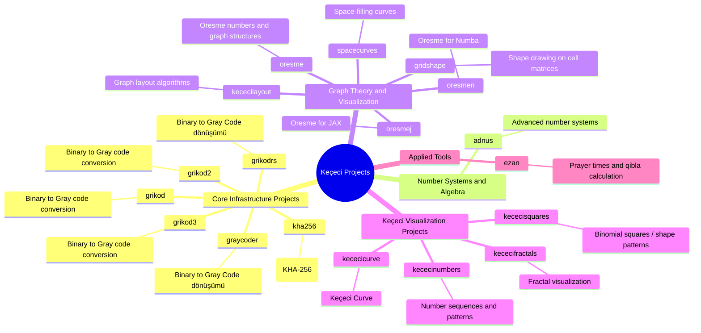
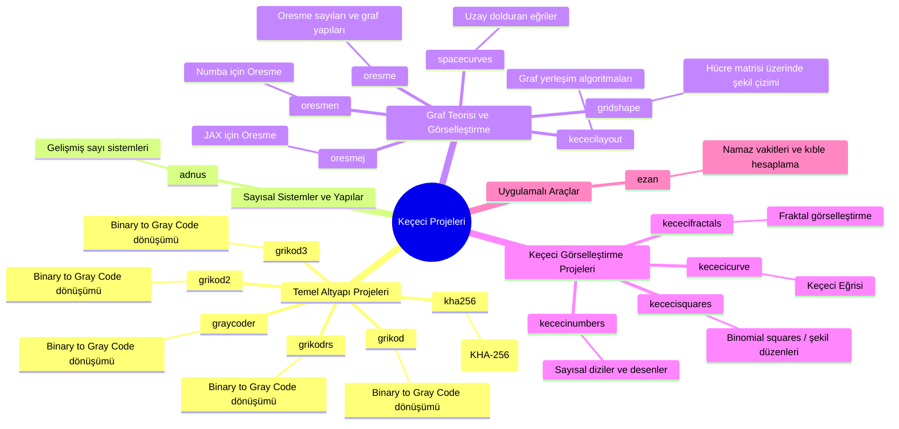
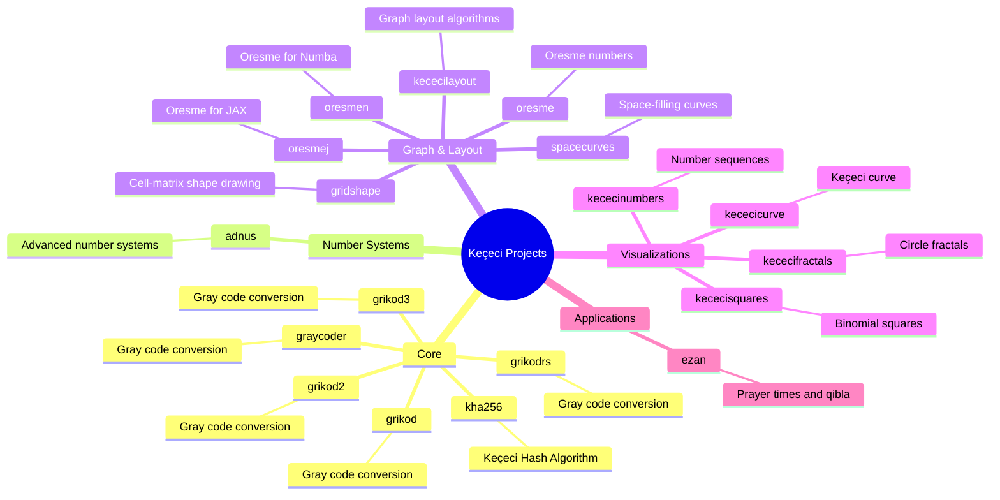
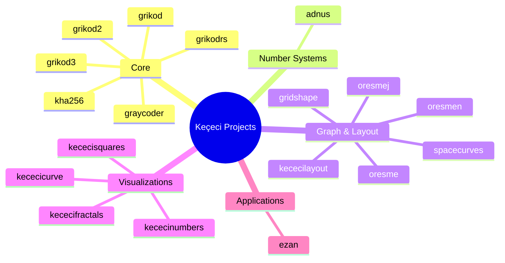

---
  <a
    id="cy-effective-orcid-url"
    class="underline"
     href="https://orcid.org/0000-0001-9937-9839"
     target="orcid.widget"
     rel="me noopener noreferrer"
     style="vertical-align: top">
     
      https://orcid.org/0000-0001-9937-9839
    </a>
---

---

### Keçeci Projects

| Category | Projects | Notes |
|---|---|---|
| Core | grikod, grikod2, grikod3, graycoder, grikodrs, kha256 | Gray code and hashing |
| Number Systems | adnus | Advanced number systems |
| Graph & Layout | oresme, oresmej, oresmen, kececilayout, gridshape, spacecurves | Graph theory, layouts, and geometry |
| Visualizations | kececifractals, kececicurve, kececisquares, kececinumbers | Fractals, curves, and numeric patterns |
| Applications | ezan | Prayer times and qibla |

---
