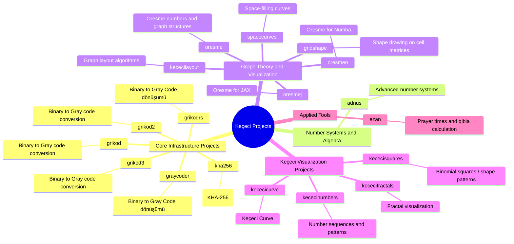
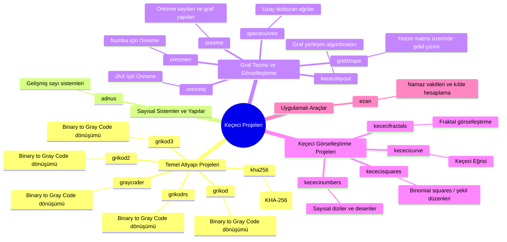
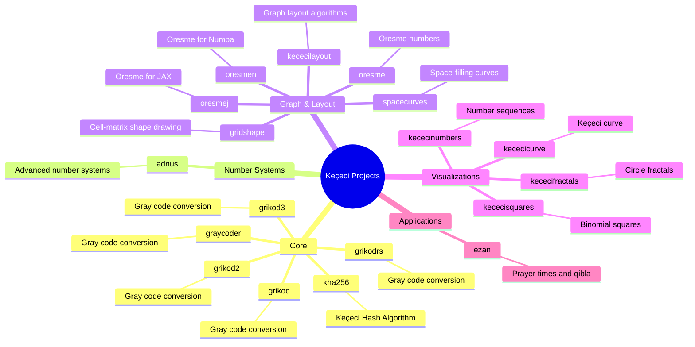
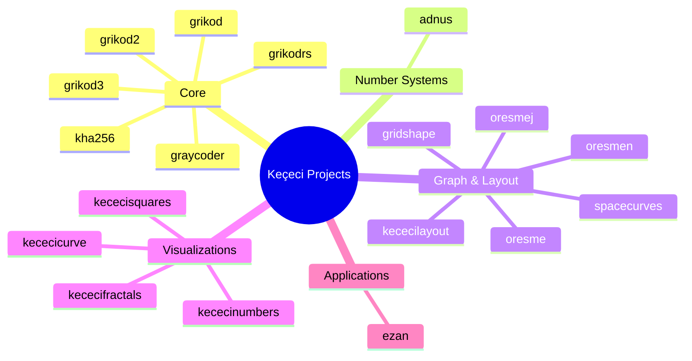

### Keçeci Projects

| Category | Projects | Notes |
|---|---|---|
| Core | grikod, grikod2, grikod3, graycoder, grikodrs, kha256 | Gray code and hashing |
| Number Systems | adnus | Advanced number systems |
| Graph & Layout | oresme, oresmej, oresmen, kececilayout, gridshape, spacecurves | Graph theory, layouts, and geometry |
| Visualizations | kececifractals, kececicurve, kececisquares, kececinumbers | Fractals, curves, and numeric patterns |
| Applications | ezan | Prayer times and qibla |

---
